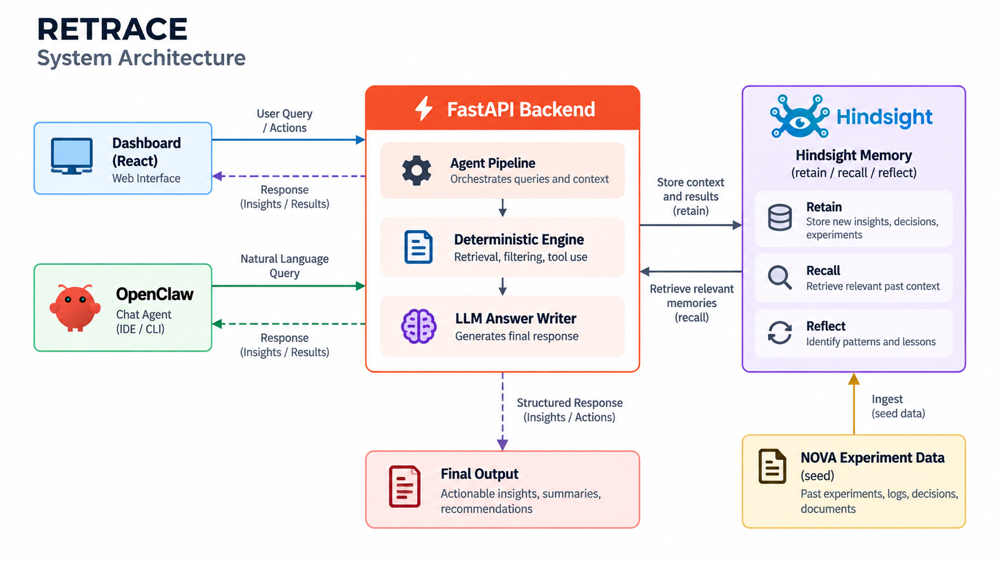

<div align="center">

# RETRACE

### The memory of your experiments

*Companies don't lack data. Their experiments just never add up to knowledge.*


[How it works](#how-it-works) · [Hindsight](#how-retrace-uses-hindsight) · [Run it](#run-it) · [Install the agent](#install-retrace-as-a-self-driving-agent) · [Layout](#layout)

</div>

---

RETRACE remembers not just what a product team tested, but **the conditions, what the team concluded, and how later evidence changed that conclusion**.

Ask *"Should we bring gamified onboarding back?"* and it answers in four parts:

| 🧠 What we believed | 👀 What we later saw | ✅ What we now know | ❓ What remains unknown |
|:---:|:---:|:---:|:---:|
| The original conclusion, dated | Evidence that arrived afterwards | The current, re-judged belief | The open question worth testing next |

## The demo company: NOVA

A Bengaluru learning app (2.3M users) with two years of experiment history and three hidden stories:

| Belief | What really happened | RETRACE says |
|---|---|:---:|
| "Gamification hurts onboarding" (EXP-07, Mar 2024) | It only hurt with 7-step onboarding; with 3 steps it helped (EXP-10 vs EXP-13) | 🔄 **Revised** |
| "Push notifications hurt retention" (EXP-09) | 5/day hurt; 1–2/day helped (EXP-24 arrives live in the demo) | ⚠️ **Challenged → Revised** |
| "Dark mode doesn't move retention" (EXP-06) | Confirmed again by EXP-18 | ✅ **Held up** |
| "Annual plans scare users" (EXP-15) | Only 780 users | 🪶 **Weak basis** |

It also ignores traps: an underpowered test, a paywall test that ran during the Diwali sale and an outage, and a "gamified referral" test that uses the same word but is about something else.

## How it works

<p align="center">
  
</p>

**Pipeline:** `RETAIN → RECALL → COMPARE → REVISE → COVERAGE → ANSWER`, shown live in the memory trace.

- **Clean comparisons:** only pairs of experiments that differ in exactly one condition can isolate a factor. Everything else is labelled confounded.
- **Belief status and history:** every conclusion is a dated memory, re-judged whenever new evidence arrives (Held up / Challenged / Revised / Weak basis / Untested since).
- **Then vs now:** compares an old experiment's conditions with today's product.
- **Coverage map:** every combination of conditions, tested or not; the next test is the one that completes the most clean comparisons, phrased as an open question, never a prediction.
- **Amnesia Mode:** the same question without memory, for the before/after.

> [!IMPORTANT]
> The LLM never decides the evidence. `engine.py` computes it; Groq or OpenRouter only writes the sentences, and any answer citing an unknown experiment is rejected for a template.

## How RETRACE uses Hindsight

| Hindsight feature | Use |
|---|---|
| **Retain** | Every experiment, dated belief, observation, product change, external event, decision, team note and past answer is its own memory with timestamp, tags (`kind:`, `area:`, `exp:`), `document_id` and the structured record in metadata |
| **Recall** | 8 parallel tag-scoped queries per question (experiments, beliefs, observations, product state, events, decisions, same-word matches, team chat) |
| **Reflect** | Hindsight's own narrative of how the team's thinking evolved, shown under the answer |
| **Bank template** | `retrace-agent/bank-template.json` sets reflect/retain/observations missions, dispositions and 4 **directives** (no causal claims, weak-evidence rules, people are not causes, open questions not predictions) |
| **Mental models** | `current-beliefs` and `experiment-history`, refreshed by Hindsight after consolidation and shown in the dashboard with their version count |
| **OpenClaw plugin** | PMs chat with RETRACE; conversations are auto-captured into the same bank and appear on the dashboard as dated team notes |

## Run it

**1. Backend**

```bash
cd backend
cp .env.example .env          # add HINDSIGHT_API_KEY and GROQ_API_KEY
python3 -m venv .venv && source .venv/bin/activate
pip install -r requirements.txt
python seed.py                # once
uvicorn app.main:app --reload --port 8000
```

> [!NOTE]
> After running `seed.py`, wait 3–5 minutes before starting the server so Hindsight can process the seeded memories.

**2. Frontend** (second terminal)

```bash
cd frontend && npm install && npm run dev
```

**3. Open** http://localhost:5173

**Tests:** `cd backend && python -m pytest -q`

## Install RETRACE as a self-driving agent

```bash
npx @vectorize-io/self-driving-agents install VijayaY836/retrace/retrace-agent --harness openclaw
```

## Layout

```
retrace-agent/        self-driving-agents package (bank template + seed knowledge)
backend/app/
  engine.py           deterministic learning engine
  agent.py            RETAIN → RECALL → COMPARE → REVISE → COVERAGE → ANSWER
  memory.py           Hindsight: retain, recall, reflect, mental models, bank template
  llm.py              router, answer writer, Amnesia Mode (Groq/OpenRouter + fallbacks)
  records.py          records → Hindsight memories
  main.py             API
backend/data/nova/    NOVA's history
backend/tests/        engine tests
frontend/src/         React UI
docs/spec.md          product spec
```
